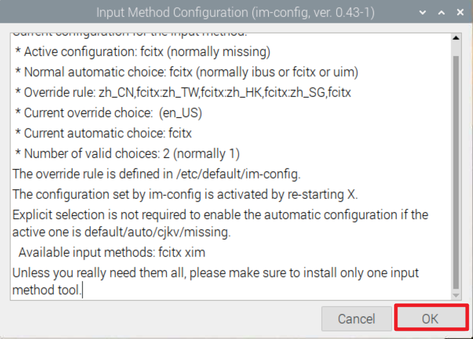
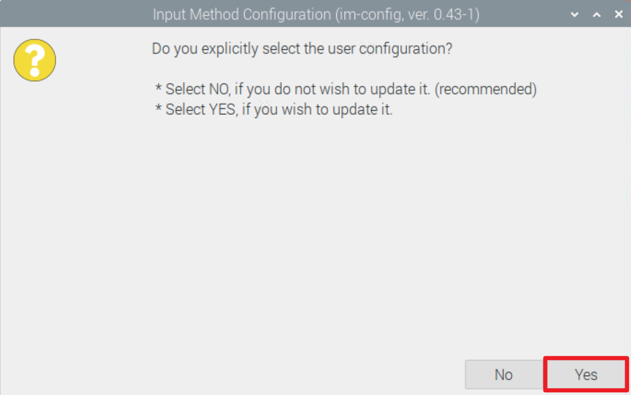
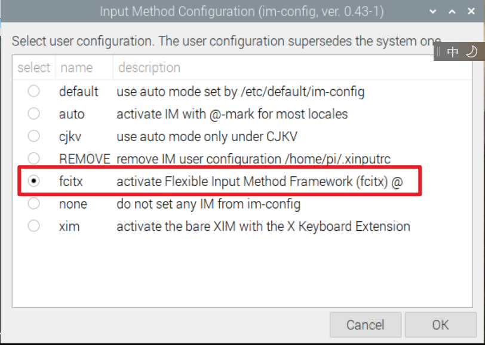
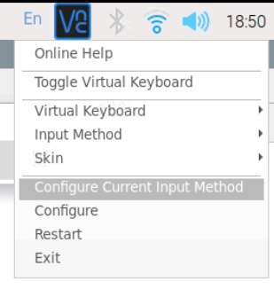
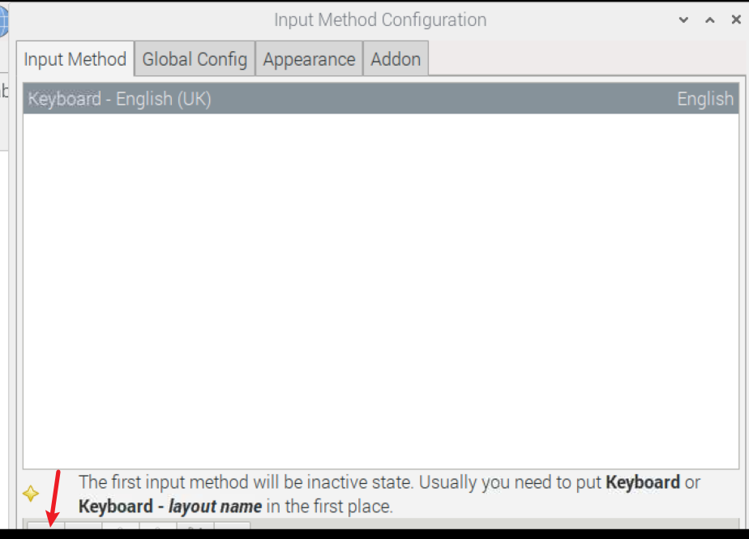
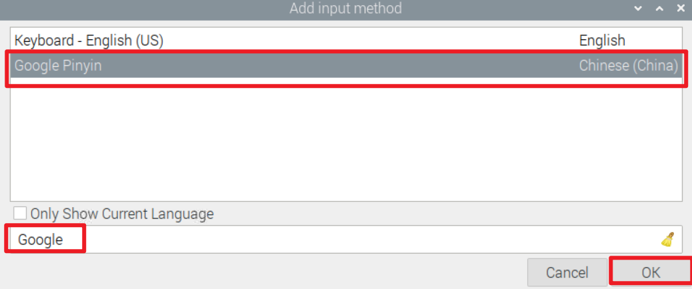
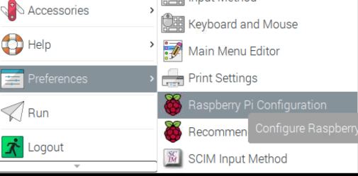
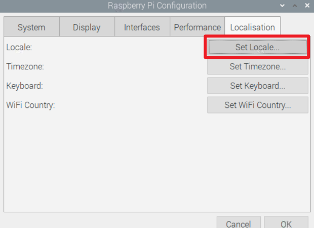
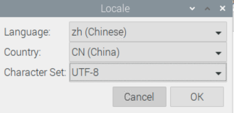

# 安装中文支持软件包

## 中文字体

```bash
sudo apt -y install fonts-wqy-zenhei fonts-wqy-microhei
sudo fc-cache
```

## 输入法

```bash
sudo apt-get install fcitx fcitx-googlepinyin
im-config
```







然后OK,OK

#### 输入法配置





然后关闭窗口

中文输入法配置完毕

## 设置系统语言为中文







然后点击确定， 并按指示重启


如果调节为中文后界面仍为英文， 请按上述步骤将语言调节为英文，重启之后再调节为中文，然后再按指示重启系统。