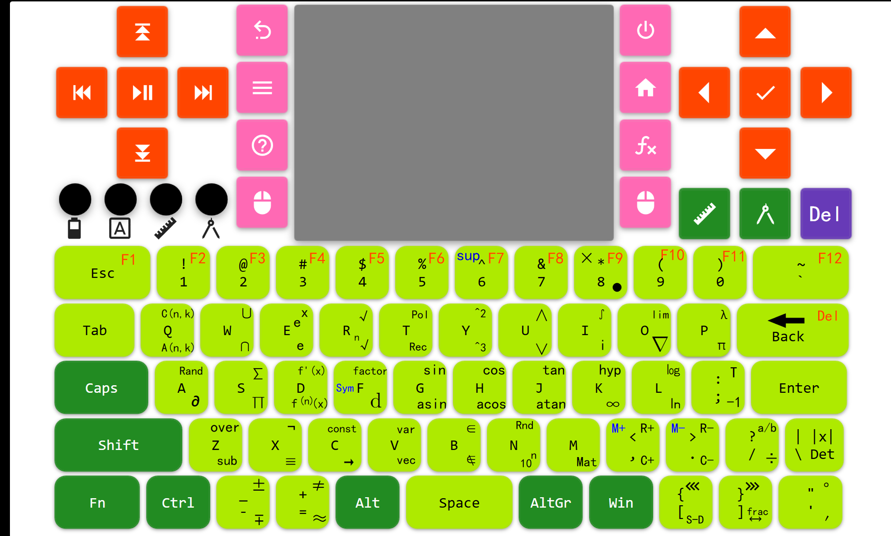

# 修改键盘映射方案

## 目标图片

## 分析

- 部分按键重映射通过修改`~/.Xmodmap`来完成.
- 难点在于实现尺键和规键
- :warning:高难度工作 , 可能需要手写一个输入法!

## 参考

- https://stackoverflow.com/questions/27581500/hook-into-linux-key-event-handling

- https://superuser.com/questions/404457/how-can-i-change-the-input-keyboard-layout-while-in-the-console